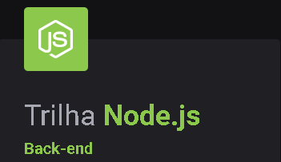

<h3 align="center">
    
    <br><br>
    <p align="center">
      <a href="#-tecnologias">Tecnologias</a>&nbsp;&nbsp;&nbsp;|&nbsp;&nbsp;&nbsp;
      <a href="#-links-do-projeto">Links</a>&nbsp;&nbsp;&nbsp;|&nbsp;&nbsp;&nbsp;
      <a href="#-como-contribuir">Como contribuir</a>&nbsp;&nbsp;&nbsp;|&nbsp;&nbsp;&nbsp;
      <a href="#-license">Licença</a>
  </p>

</h3>
<p align="center">
  <a href="https://rocketseat.com.br">
    
  </a>
</p>

## 🔖 Sobre

O <strong>NPS-API</strong> é uma API Restful para Net Promoter Score.

Aplicação web construída na trilha <strong>NodeJS</strong> da <strong>Next Level Week</strong> distribuída pela [Rocketseat](https://rocketseat.com.br/).

## 🚀 Tecnologias

Esse projeto foi desenvolvido com as seguintes tecnologias:

- [Node.js](https://nodejs.org/en/)
- [Express](https://expressjs.com/pt-br/)
- [YARN](https://yarnpkg.com/)

## ⤵ Comandos para começar

Essas instruções vão te levar a uma cópia do projeto rodando em sua máquina local para propósitos de testes e desenvolvimento. Foram implementados testes de integração.

Obs: Banco de dados é o Sqlite3, caso queira alterar, configure o arquivo ormconfig.json para seu banco de dados específico (Campo "database" é o nome do banco de dados no SGBD, neste projeto é local).

```bash
- git clone https://github.com/Lucas-Angelo/nps-api.git
- cd nps-api
```

Instalando dependências (Recomendável utilizar NPM para compatibilidade com reflect-metadata)

```bash
- npm install
```

ou

```bash
- yarn install
```

Gerar o arquivo de database.sqlite do Sqlite3, onde ficaram armazenados as tabelas da API

```bash
- yarn devDB
```

Criando tabela das migrations do Sqlite3 por meio do cli do TypeOrm

```bash
- yarn typeorm migration:run
```

Inicializando uma instância local (Script configurado no package.json)

```bash
- yarn dev
```

## ⤵ Testes

Para testar se instalou a aplicação corretamente e se passa em todos os testes de integração, utilize o comando:

```bash
- yarn test
```

## 🔗 Links do projeto

### Notion
- [Ambiente](https://www.notion.so/Configura-es-do-ambiente-Node-js-ae9fea3f78894139af4268d198294e2a)

### Resources
[Ícones e Wallpapers](https://drive.google.com/drive/folders/11fxy_LmTD6S1FGTQbeu47QPLzvyuEGSs)


## 🎓 Quem ministrou?

As aulas foram ministradas pela **[Daniele Leão](https://github.com/danileao)** na **Next Level Week 04**.

## 🤔 Como contribuir

- Faça um fork desse repositório;
- Cria uma branch com a sua feature: `git checkout -b minha-feature`;
- Faça commit das suas alterações: `git commit -m 'feat: Minha nova feature'`;
- Faça push para a sua branch: `git push origin minha-feature`.

Depois que o merge da sua pull request for feito, você pode deletar a sua branch.

## 📝 License

Esse projeto está sob a licença MIT. Veja o arquivo [LICENSE](LICENSE) para mais detalhes.

---

<h4 align="center">
    Feito com 💜 by <a href="https://www.linkedin.com/in/leonardo-costa-65aa26b5" target="_blank">Leonardo Costa</a>
</h4>
